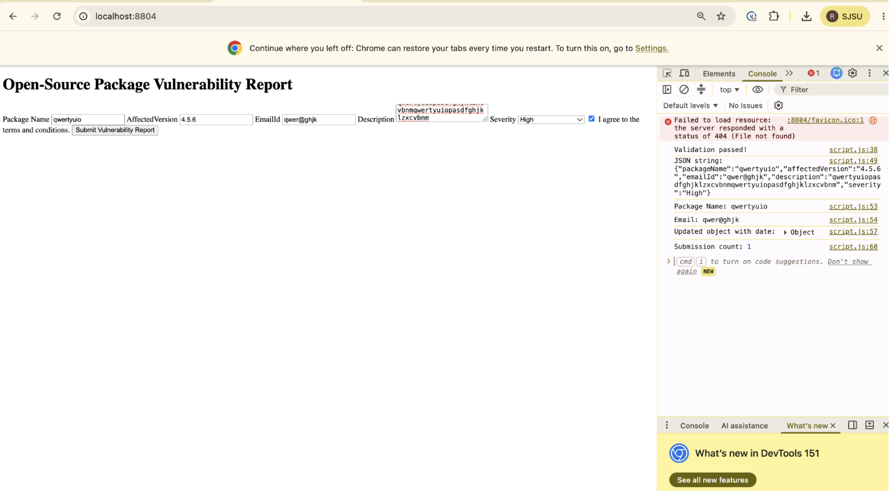
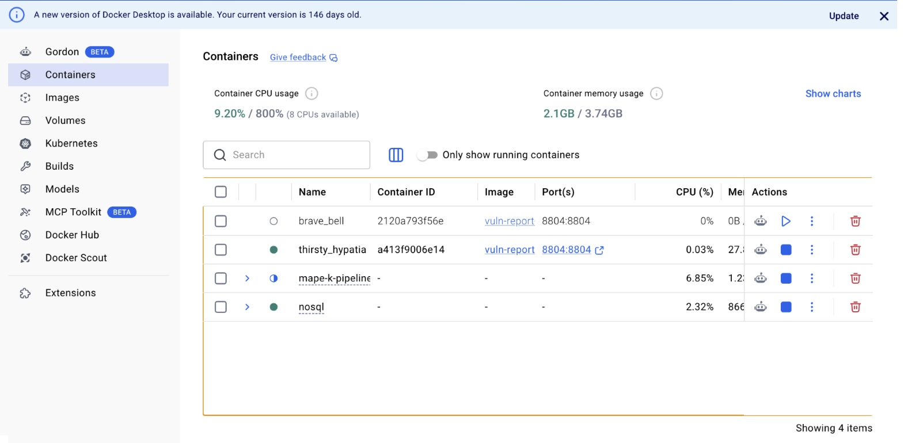
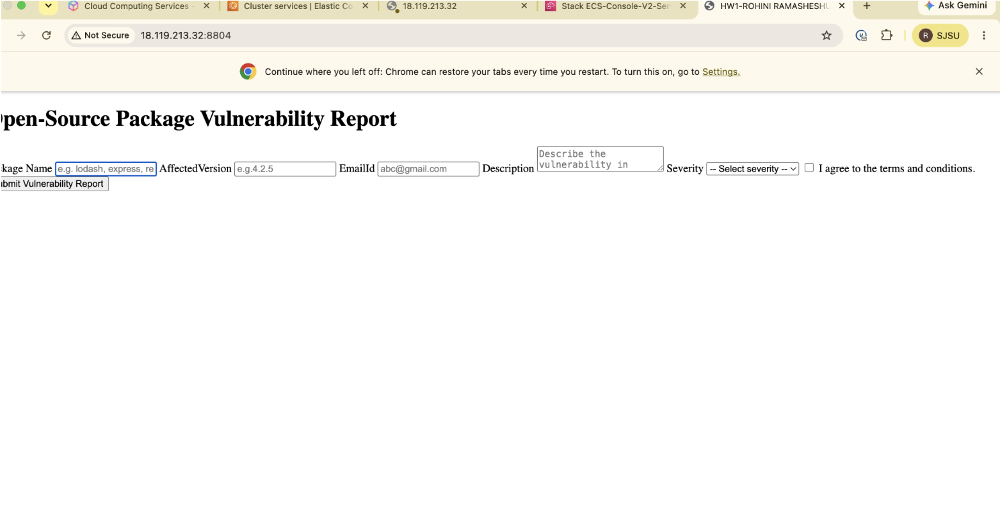
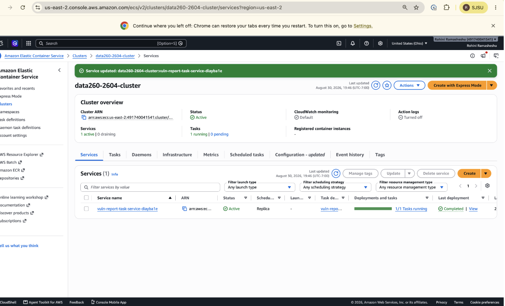

# DATA-260 Homework 1 Report
**Name**: Rohini Ramasheshu

## Configuration Values

- SID4: 2604
- PORT_BASE: 8804
- PREFIX: s2604
- SEED: 2604
- VERIFY_SEED: 262604
- DOMAIN_ID: 4 (Open-source package vulnerabilities)

## Hardware & Model

- Hardware: MacBook Air M2, 8GB RAM
- Local model used: qwen2.5:3b (substituted for qwen3:8b due to 8GB RAM constraint)
- Tagged commit hash: 68ac1105b1a37bc7bf7b7eb305df15f67d9e4c47
## Part 1 — HTML/JavaScript Form

Built a vulnerability report form with required fields (package name, affected version, email, description, severity dropdown, terms checkbox) and JavaScript validation using arrow functions, JSON conversion, destructuring, spread operator, and closures for submission tracking.

   
## Deployment — Docker

Built and ran the app in a Docker container locally on port 8804.

   
## Deployment — AWS ECS

Deployed the Docker image via AWS ECR + ECS Fargate, exposing it on a public IP. Encountered and resolved a CPU architecture mismatch (image built for arm64 on Apple Silicon, but Fargate required amd64) by rebuilding with `--platform linux/amd64`.

   

   
Service and cluster were deleted immediately after confirming successful deployment to avoid ongoing AWS charges.

## Part 2 — Agentic AI

Built a Planner → Reviewer → Finalizer pipeline using Ollama + langchain-ollama.

- **Q1 (final tags)**: ["lodash", "security", "prototype-modification"]
- **Q2 (final summary)**: "Prototype pollution vulnerability in lodash can lead to security issues in applications that handle user input." (19 words)
- **Q3 (did Reviewer change anything?)**: Yes — it replaced the tag "vulnerability" with "security" for more standardized terminology, while keeping the summary otherwise consistent.

**Explanation of each step**:
- **Planner**: given a title and content, drafts initial tags and a summary using a structured JSON-only prompt.
- **Reviewer**: receives the Planner's draft and checks/improves it, returning JSON in the same format.
- **Finalizer**: parses the Reviewer's JSON output, handling parse failures gracefully, and produces the final clean output.

## Part 3 — Non-Determinism Experiment

See `METRICS.md` for full results table and `raw/nondeterminism_results.csv` for all 40 runs.

**Summary**: At temperature 0.7, 20 runs produced 10 distinct tag sets — meaningful run-to-run variation. At temperature 0.0, all 20 runs produced identical results (1 distinct tag set), confirming near-deterministic behavior at low temperature.

## Part 4 — Model Client & Token Accounting

Built a reusable `model_client.py` adapter with a `complete(messages, tools=None)` interface, token counting per turn, and a `/stats` method reporting cumulative totals without altering history.

Ran a 5-turn conversation; `/stats` after turn 3 and turn 5 confirmed correct accumulation (turn 5: 5 turns, 194 total input tokens, 1848 total output tokens, 10662 history characters).

**Observation**: Turn 5 ("summarize what we discussed") produced a generic answer with no reference to earlier topics, revealing that our `complete()` method sends only the current message, not accumulated history — directly illustrating why real conversational memory requires explicitly resending context.

**Theory answers**:
- *Why is prior context resent every turn?* LLMs are stateless between calls; without resending history, the model has no memory of prior turns, as demonstrated above.
- *System prompt vs. user message?* A system prompt sets persistent behavior/instructions for the whole conversation; a user message is one turn of actual conversation content.
- *Why do input tokens grow over a conversation?* If full history were resent each turn, each new turn's input would include all prior turns, growing linearly with conversation length.
- *What eventually limits that growth?* The model's fixed context window — once history + new input exceeds it, older content must be truncated or summarized.

## AI Use

See `AI_USE.md` for full disclosure.
